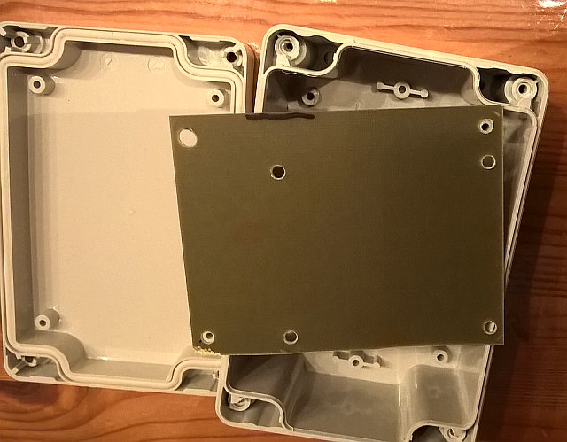
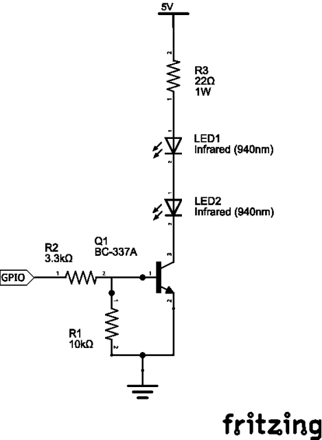
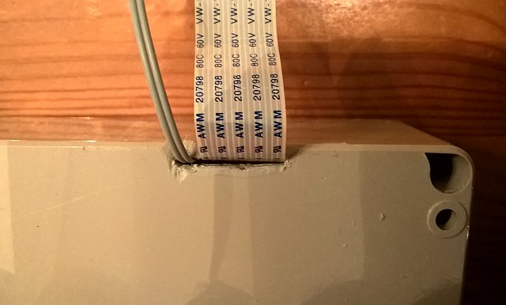
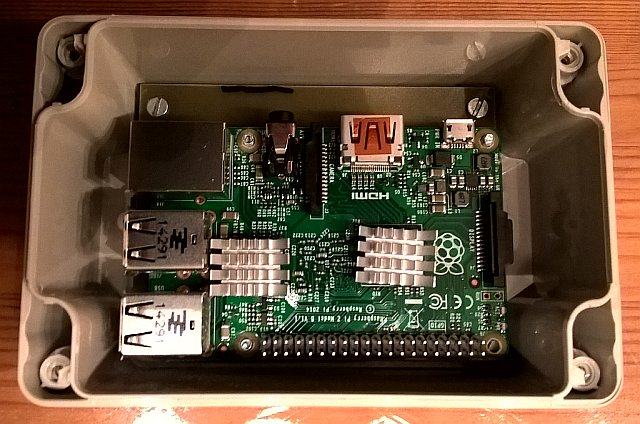
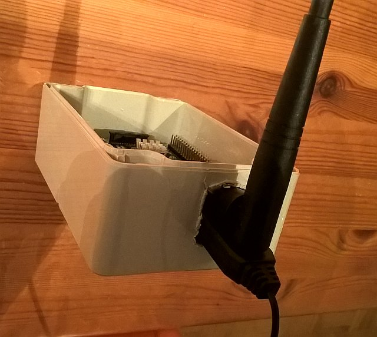
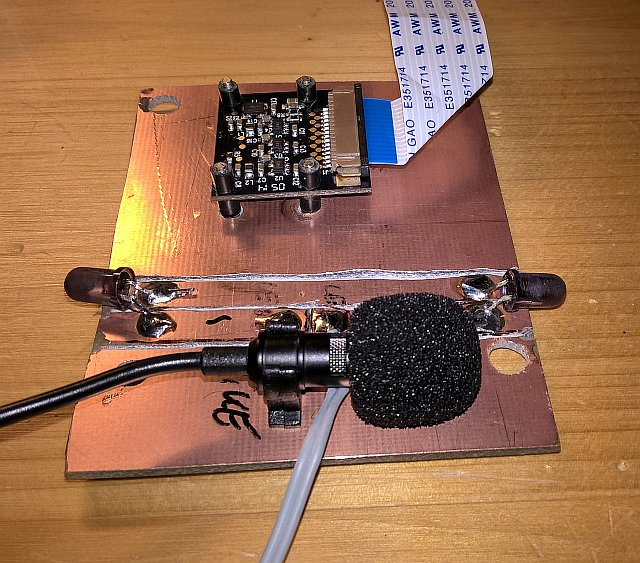

#BirdBox#

My version of a RaspberryPi Bird Box

On the Raspberry Pi Homepage I found a tutorial about a [bird box](https://www.raspberrypi.org/learning/infrared-bird-box/) watching camera. As I had a [Pi NoIR camera](https://www.raspberrypi.org/learning/infrared-bird-box/components/camera-noir/) and a [Raspberry Pi 2](https://www.raspberrypi.org/products/raspberry-pi-2-model-b/) at hand for no other purposes, I started this project in mid February. I hoped this won't be to late for some birds to find a home in the box.

Here I'll describe the several steps that led me to the final box...

## Ignite ##

[The ignition from the Raspberry Pi Homepage](https://www.raspberrypi.org/learning/infrared-bird-box/)

## Case ##

As the Box is (of course) located outside, and the Pi too, a weatherproofed case was needed. I found

- [BOPLA Euromas II ET-215 (120x80x57mm³)](https://www.reichelt.de/Kunststoffgehaeuse-BOPLA/BOPLA-ET-215/3/index.html?ACTION=3&LA=5700&ARTICLE=5729&GROUPID=7712&artnr=BOPLA+ET-215)

To fit all components (Pi, wiring, WiFi and microphone connectors) into the case a quick (and dirty) hack was done, as you can see in the pictures. Thanks to an adapting plate the case suits well to the Pi.

But the WiFi antenna and the USB connector stick out. The only solid connection to the outer world is a four lines shielded wire.

- 2 lines are for 5 V power
- 1 line is Serial TX for data from the Pi
- 1 line is Serial RX for data to the Pi
- Shield is GND

The serial lines were chosen to get access to the hidden Raspberry Pi, if wireless access fails.

In the end all openings (USB, wirings) were sealed with silicone for outside purposes and the case screwed onto the bird box.

## WiFi ##

In the beginning I asked myself to use either a RPi3 with WiFi onboard or an older RPi2 with an external WLAN stick. After a few measurements of the WiFi range I decided to order a new WLAN USB stick with a **real** antenna to use it with the RPi2.

- [Edimax EDI EW-7612UAN](https://www.reichelt.de/WLAN-Adapter/EDI-EW-7612UAN/3/index.html?ACTION=3&LA=5700&ARTICLE=104399&GROUPID=5839&artnr=EDI+EW-7612UAN)

## LEDs ##

It's dark inside the box. Two Infrared (IR) LEDs are used to illuminate what's happening with the birds. I sanded down the LEDs a bit to get a more diffuse light. And they are not directly pointing to the birds but to the walls of the bird box.

- [LD 271 Infrared Diode, 950 nm, 25°](https://www.reichelt.de/Fotodioden-etc-/LD-271/3/index.html?ACTION=3&LA=5700&ARTICLE=10199&GROUPID=3045&artnr=LD+271)

I think it is a good idea not to power the IR-LEDs all the time. There may be times no birds are living in the box or the whole streaming/pi/camera stuff is down due to reasonsTM. So I added a NPN-transistor to the two LEDs in line, to be triggered by a GPIO of the Pi.

## Microphone ##

From internet sources about streaming out of a bird box I found they all were using the video stream only. What about sound? To get the option of experimenting with and later adding sound from the birds inside the box, I mounted a small USB ready microphone into the box too.

As the Pi has no sound/mic input, I bought this one: 

- [Blusmart USB Lavalier Microphone](https://www.amazon.de/dp/B01MZ60SAR/ref=sr_1_2?ie=UTF8&qid=1488534236&sr=8-2&keywords=lavalier+mikrofon+usb)

So far, I have no idea, if and how it'll work. But the ALSA recording tool that comes with the Raspian distro indicated different sound levels from the mic though nothing useful was recorded yet.

## Assembly ##

As I hadn't have much time for a proper assembly after business hours and family needs, it became really a rather quick and dirty hack. See the following pictures...

###The completed case###

###The box electrics###

## Software ##

... under construction!

## Licensing ##

Please respect all licenses.

The initial tutorial is provided for free by the [Raspberry Pi Foundation](https://www.raspberrypi.org/) under a [Creative Commons](https://www.raspberrypi.org/creative-commons/) licence. Find more at [raspberrypi.org/resources](https://www.raspberrypi.org/resources/) and [github.com/raspberrypilearning](https://github.com/raspberrypilearning).

All my additions to the project or own creations for the project are for use under the  **Beer-Ware License** (Revision 42.fs): "<dl6dbn@googlemail.com> made this stuff. As long as you retain this notice you can do whatever you want with this stuff. If we meet some day, and you think this stuff is worth it, you can buy me a beer (or another drink I like) in return." *Frank Sperber (DL6DBN)* with thanks to [PHK](https://people.freebsd.org/~phk/) for writing down this beautiful kind of license.

*as of: March 2017*
